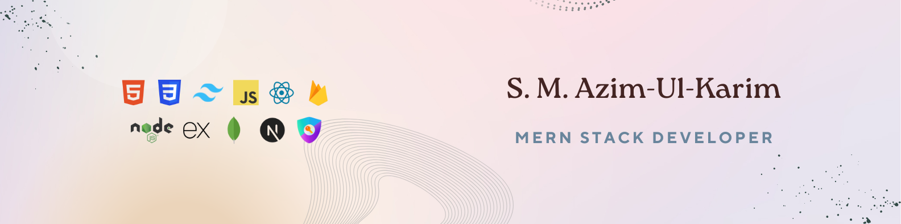

<h1 align="center">
    
</h1>

    I’m a MERN Stack Developer with a background in Electronics & Telecommunication Engineering from Rajshahi University of Engineering & Technology. 
    I strive to develop purposeful, user-friendly web applications that feature clean interfaces, enhance accessibility, and foster effective communication.

- 🌱 Currently focusing on **Next.js**, **scalable frontend architecture**, and **API integration**
- 🎯 Interested in **full-stack development** and **AI-assisted web applications**
- 📫 Contact: **azimulkarim.ete@gmail.com**

---

<h2 align="center">⚙️ Tech Stack</h2>

  
  

---

<h2 align="center">📈 Activity</h2>

  <!-- Streak Stats -->
  

  <!-- Top Languages -->
  

  <!-- Contribution Graph -->
  

  

